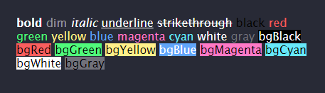
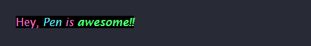

<div align='center'>
<h1>inken</h1>
<p>string styling for the browser</p>

</div>

> With inspiration from [yoctocolors](https://github.com/sindresorhus/yoctocolors), this module provides terminal-like string styling functionality in the browser.

## Features

- Expressive API
- Highly performant
- Ability to nest styles
- Clean and focused
- Actively maintained

## Install

```console
$ npm install pen
```

## Usage

### HTML

```html
<div id='console'></div>
```

### JavaScript

```js
import { blue } from 'inken';

const consoleBox = document.getElementById('console');

function log(...data) {
    consoleBox.innerHTML += `<div>${data.join(' ')}</div>`;
}

log(blue('Hello World!'));
```

## Demo

To run the [demo](./demo/), fork this repo and simply open the index.html file in your browser.

## Styles

### Modifiers

- `bold` - Make the text bold.
- `dim` - Make the text have lower opacity (sets css opacity to `0.5`).
- `italic` - Make the text italic.
- `underline` - Underline the text.
- `strikethrough` - Put a horizontal line through the center of the text.

### Colors

- `black`
- `red`
- `green`
- `yellow`
- `blue`
- `magenta`
- `cyan`
- `white`
- `gray`

### Background colors

- `bgBlack`
- `bgRed`
- `bgGreen`
- `bgYellow`
- `bgBlue`
- `bgMagenta`
- `bgCyan`
- `bgWhite`
- `bgGray`

## API

Multiple arguments, nesting and ES2015 template literals supported by all styles.

In code samples below, `'...'` represents the implementation of the `log` function from the [previous section (usage)](#javascript) 

- Multiple arguments

    ```js
    log(blue('Hello', 'World!', 'JS', 'is', 'cool'));
    ```

- Nested styles

    ```js
    import { bgBlack, yellow } from 'inken';

    ...

    log(bgBlack(yellow('Hello, World!')));
    ```

- ES6 template literals

    ```js
    import { green } from 'inken';

    ...

    const user = 'Guest';
    log(`Hello ${green(user)}!`);
    ```

## Example

All-in-one:

```js
import { bold, cyan, green, italic, magenta } from 'inken';

...

log(
    bgBlack(magenta(
        'Hey, ' + italic(cyan('Pen'), `is ${bold(green('awesome!!'))}`)
    ))
);
```

Output:


 

## LICENSE

Released under the [MIT License](./LICENSE)
